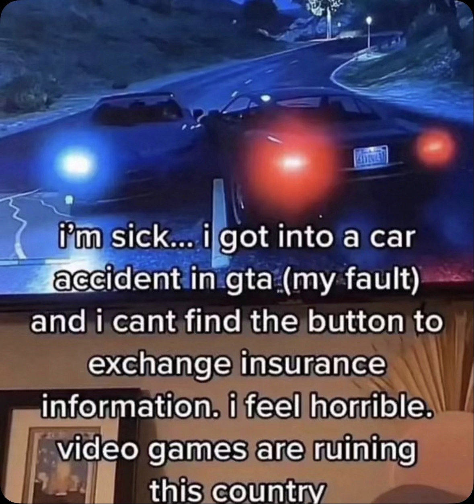
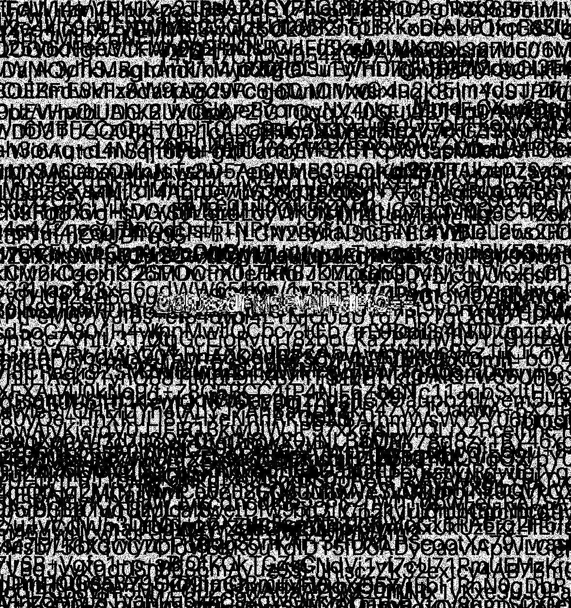
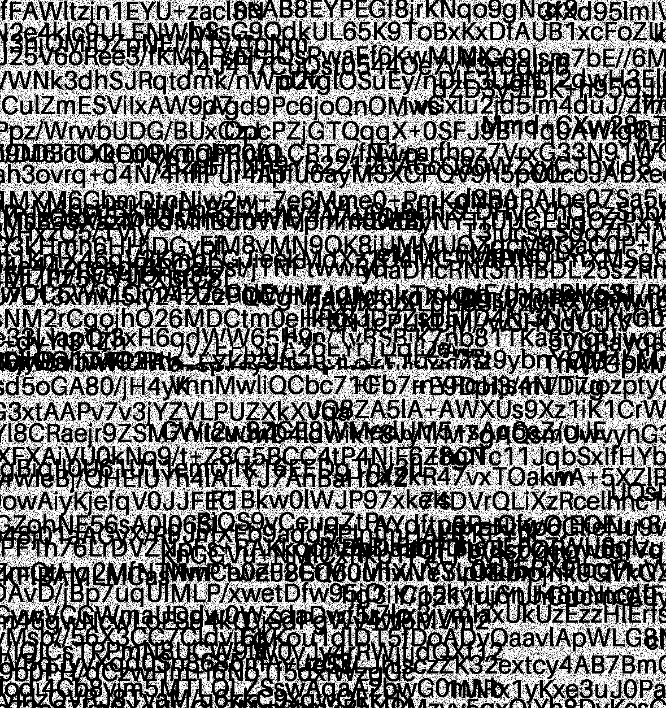
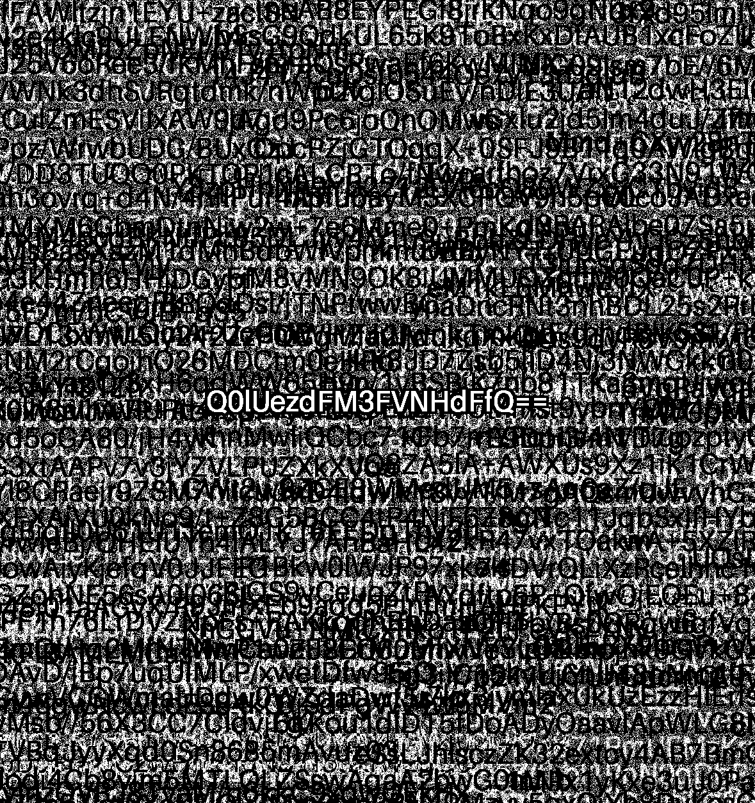

## Car Crash

Desc

### Attachment

- car_crash.png

### Story

I don't know how to solve this one. But I know something when I extract LSB from all the channels.

Original:



LSB from alpha channel:


Where can see something blurry in the middle of the image. Okay, that's dead end for me. But another guy told me to XOR that one with the image extracted from LSB from green channel.

LSB from green channel:


When xorring together:



The base64 code appear. Which decode to:

### Final Flag

```
CIT{7E3qU4wE}
```
