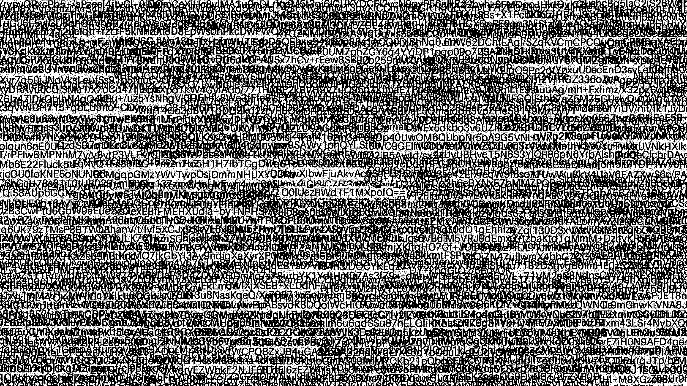

## Cool Car

I got this cool car here, maybe you can find a flag.

### Attachment

- cool_car.png

### Story

In this problem, I told the AI to do a lot of things to extract data from the original image and I will checkback later. One of them ended of contain the solution. Which was the LSB from the alpha channel

**Original**


**extracted LSB from alpha channel**


We can see the base64 code in the middle of the image. This gave me the flag after decode

### Final flag

```
CIT{4Vu1u1zh}
```
